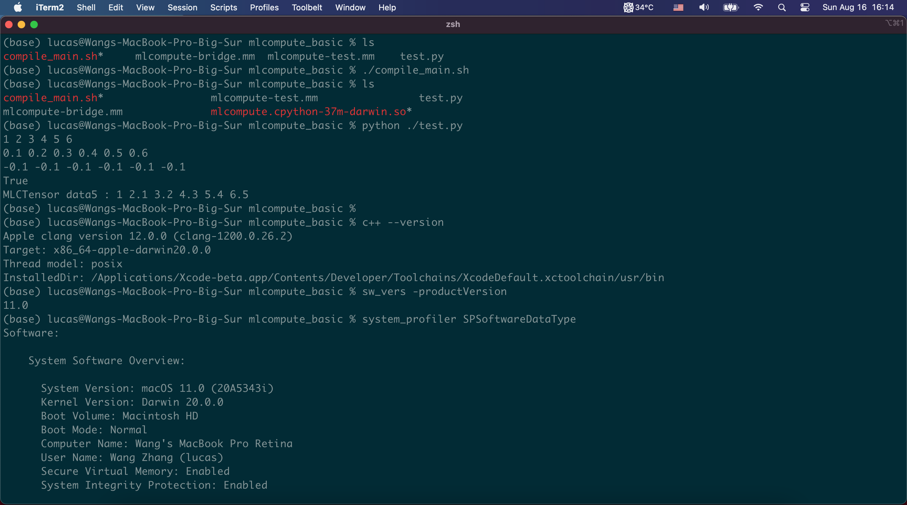

# 苹果偷偷搞了一个 MLCompute 库

## macOS 上跑训练？

我们的算法工程师想必都知道，macOS 上跑 CUDA 来训练网络已经是很久之前的事情了。即便时候来苹果推出了自己的 GPU 通用计算库 [Metal](https://developer.apple.com/documentation/metal) 和 [Metal Performance Shader](https://developer.apple.com/documentation/metalperformanceshaders)（下文简称 MPS）之后，苹果在支持 GPU 机器学习上也非常的保守。Metal 可以类比成苹果的 OpenCL + OpenGL 或者 CUDA （Driver API），MPS 则有点 cuDNN 的感觉。依赖 Metal 和 MPS，确实也可以来做一些深度学习的推理和训练。然而其 API 的设计过于接近图像处理，对神经网络的构建反而不那么贴近。所以时至今日，我了解到的之后两个框架在使用 Metal：[PlaidML](https://github.com/plaidml/plaidml) 和 [Taichi](https://github.com/taichi-dev/taichi)。即使和 TensorFlow 合作推出了 [Swift-for-TensorFlow](https://www.tensorflow.org/swift)，似乎依然看不到 GPU 支持的影子。


或许是感觉到了这方面的问题，当我试用了 macOS big sur + Xcode 12 之后，突然发现苹果偷偷高了一个专门针对于机器学习的 framework，叫 [MLCompute](https://developer.apple.com/documentation/mlcompute/)。

和其他的 framework 一样，MLCompute 提供两种 API：Swift 和 Objective-C。我在网上搜索相关例子的时候，发现了这篇调用 Swift API 的文章：https://towardsdatascience.com/use-apple-new-ml-compute-framework-to-accelerate-ml-training-and-inferencing-on-ios-and-macos-8b7b84f63031。对于了解 Swift 的同学可以直接看这篇文章，会讲得更详细。而考虑到许多算法同学更经常打交道的是 Python 和部分 C++，于是我根据上述文章中的 Playground 例子，改写了一个 Python 版本。

**先上源码：https://github.com/zw0610/A3/tree/mlcompute/mlcompute_basic**

- `mlcompute-test.mm` 是一个纯的 Objective-C++ 脚本，用来实现上面提到的 Playground 例子，也就是把三个 Tensor 相加，得到第四个 Tensor。
> [Objective-C++](https://en.wikipedia.org/wiki/Objective-C#Objective-C++) 应该算是一种编程语言的变种：它支持 Objective-C 和 C++ 的混合代码由 Clang 编译。
- `mlcompute-bridge.mm` 是将 `mlcompute-test` 中的结构和功能抽出，并由 [pybind11](https://github.com/pybind/pybind11) 包装以便让各位同学在 Python 可以直接调用。
- `test.py` 即为 Python 调用的脚本。
- `compile_main.sh` 是将 `mlcompute-bridge.mm` 编译成动态链接库的脚本。

在跳入具体的代码之前，我们现简单了解一下 MLCompute 重的一些大致概念。

## MLCompute 的大致概念

### 数据

MLCompute 中主要有两类数据类型：`MLCTensor` 和 `MLCTensorData`。前者像是一个又一个的 Node，描绘了数据运行的一个又一个节点，而连接这些节点的就是各种 Ops，具备梯度计算功能。`MLCTensorData` 是对真实数据的封装，不记录对其的操作，没有记计算梯度功能。

### Ops

当前 MLCompute 支持的 Ops 对于一个 Experimental 阶段的 framework 来说还是比较全的。无论是基本的 Element-wise、Fully Connect 还是 Convolution，亦或是 LSTM、Embedding 还是 Multi-head Attention 都支持。

### Graph

在 MLCompute 中有一个 Generic 的 Graph 定义：`MLCGraph`。图的构建全部交由 `MLGraph` 的 API 完成。而针对单纯的 Inference 或是 Training，有 `MLCInferenceGraph` 和 `MLCTrainingGraph` 从 `MLCGraph` 中获取图的定义，再做进一步的处理。

从我的了解看，现在只支持静态图。

## 人生苦短，我用 Python

好了，废话不多说，我们直接看主要代码吧。这里的代码会涉及到 Objective-C++ 的一些用法，希望大家有点小准备：

> 在 C++/Python 重的调用 member method：`class.member_method(param1=arg1, param2=arg2, ...)` 在 Objective-C++ 中会变成 `[class member_method_param1:arg1 param2:arg2]`

对一些基础类的定义我们就直接放连接，不占篇幅了。大家有兴趣的话可以直接点开来看：

> *这里支持实验性质的封装，写得非常简陋。加上我其实不太懂 Objective-C，还希望大家多多包涵。*

| MLCompute Class | pybind11 中的封装 | 代码行数 | 备注 |
|--|--|--|--|
| MLCTensor | tensor | [L69](https://github.com/zw0610/A3/blob/mlcompute/mlcompute_basic/mlcompute-bridge.mm#L69) |  |
| MLCTensorData | tensor_data | [L92](https://github.com/zw0610/A3/blob/mlcompute/mlcompute_basic/mlcompute-bridge.mm#L92) |  |
| MLCDevice | device | [L109](https://github.com/zw0610/A3/blob/mlcompute/mlcompute_basic/mlcompute-bridge.mm#L109) |  |
| MLCLayer | layer | [L122](https://github.com/zw0610/A3/blob/mlcompute/mlcompute_basic/mlcompute-bridge.mm#L122) | 虚类 |
| MLCArithmeticLayer | arithmetic_layer | [L141](https://github.com/zw0610/A3/blob/mlcompute/mlcompute_basic/mlcompute-bridge.mm#L141) | 需要对 Layer 进行继承，并实现虚函数 |
| MLCGraph | graph | [L156](https://github.com/zw0610/A3/blob/mlcompute/mlcompute_basic/mlcompute-bridge.mm#L156) |  |
| MLCInferenceGraph | inference_graph | [L71](https://github.com/zw0610/A3/blob/mlcompute/mlcompute_basic/mlcompute-bridge.mm#L171) | 执行 `compile`、`execute` 的主体 |

Python 测试脚本非常的简单易懂：

```python
import time

import numpy as np

# import the .so file from `mlcompute-bridge.mm`
import mlcompute as mlc


if __name__ == "__main__":
    # prepare tensors
    tensor1 = mlc.tensor([6,1], "Float32")
    tensor2 = mlc.tensor([6,1], "Float32")
    tensor3 = mlc.tensor([6,1], "Float32")

    # prepare data in numpy
    v1 = np.array([1.0, 2.0, 3.0, 4.0, 5.0, 6.0]).astype(np.float32)
    v2 = np.array([0.1, 0.2, 0.3, 0.4, 0.5, 0.6]).astype(np.float32)
    v3 = np.array([-0.1, -0.1, -0.1, -0.1, -0.1, -0.1]).astype(np.float32)

    # pass data to tensor_data
    data1 = mlc.tensor_data(v1)
    data2 = mlc.tensor_data(v2)
    data3 = mlc.tensor_data(v3)

    # validate data correctness
    for x in [data1, data2, data3]:
        x.print()

    # initialize empty graph
    g = mlc.graph()

    # create two add ops (the only op support so far)
    arith_layer1 = mlc.arithmetic_layer("add")
    arith_layer2 = mlc.arithmetic_layer("add")

    # add tensors and ops into graph
    im1 = g.add_layer(arith_layer1, [tensor1, tensor2])
    result_tensor = g.add_layer(arith_layer2, [im1, tensor3])

    # initialize inference graph from the 'generic' graph
    i = mlc.inference_graph([g])

    # specify which tensors are inputs with data fedding
    i.add_inputs({"data1":tensor1, "data2":tensor2, "data3":tensor3})

    # compile the graph regarding a device
    device = mlc.device("gpu")    
    compiling_result = i.compile(device)
    print(compiling_result)

    # execute the inference graph with read data
    execute_result = i.execute({"data1":data1, "data2":data2, "data3":data3}, 0)

    # ugly way to wait for synchronization done
    time.sleep(1)

    # check result
    result_tensor.print()
```

> *本来在 `mlcompute-test.mm` 中挺好用一个 return handler 来处理 async execute 是否完成。但是等下还要去吃饭，所以就先写了个很丑的 `time.sleep(1)`，请各位见谅！*

### 编译

将 `mlcompute-bridge.mm` 编译成 `.so` 文件的脚本：
```shell
c++ -iframework /Applications/Xcode-beta.app/Contents/Developer/Platforms/MacOSX.platform/Developer/SDKs/MacOSX.sdk/System/Library/Frameworks \
-framework Foundation -framework MLCompute \
-I /Applications/Xcode-beta.app/Contents/Developer/Platforms/MacOSX.platform/Developer/SDKs/MacOSX.sdk/usr/include \
-L /Applications/Xcode-beta.app/Contents/Developer/Platforms/MacOSX.platform/Developer/SDKs/MacOSX.sdk/usr/lib \
-O3 -w -shared -std=c++11 \
-undefined dynamic_lookup `python3 -m pybind11 --includes` \
mlcompute-bridge.mm \
-o mlcompute`python3-config --extension-suffix`
```

需要注意的是：

1. macOS big sur 上虽然带了 Python3，但是系统似乎没有自带 `python3-config`，建议用 (ana/mini)conda 来准备一个基础环境，并装上 `pybind11`。
2. `-iframework` 一定要加，并注意 `Xcode-beta.app` 的安装路径（如果你装在其他地方的）。由于我们在 macOS 上运行，所以要指定到 `macOS.platform`。
3. `-I` 与 `-L` 要与 `-iframework` 中配置的 platform 相匹配，否则会出现编译问题，如找不到头文件等

当前支持 MLCompute 的平台有 `macOS`、`iOS`、`AppleTVOS`。也就是说我们可以在这三种设备上进行训练（当然 `iOS` 和 `AppleTVOS` 更有可能参与的是联邦学习，而不是从白纸训练出一个模型出来）。

编译完成后，你会得到一个 `mlcompute.cpython-{xx}m-darwin.so`。`{xx}` 是使用的 Python 的版本。

### 测试

```shell
(base) lucas@Wangs-MacBook-Pro-Big-Sur mlcompute_basic % python ./test.py
1 2 3 4 5 6
0.1 0.2 0.3 0.4 0.5 0.6
-0.1 -0.1 -0.1 -0.1 -0.1 -0.1
True
MLCTensor data5 : 1 2.1 3.2 4.3 5.4 6.5
```

#### 环境说明



## 结语

如果有同学有兴趣一起利用下班时间为某个主流训练框架（TensorFlow 或 PyTorch）对接上 MLCompute 这个 backend 的话，我们可以聊一聊，看看可行性。

欢迎随时骚扰。

