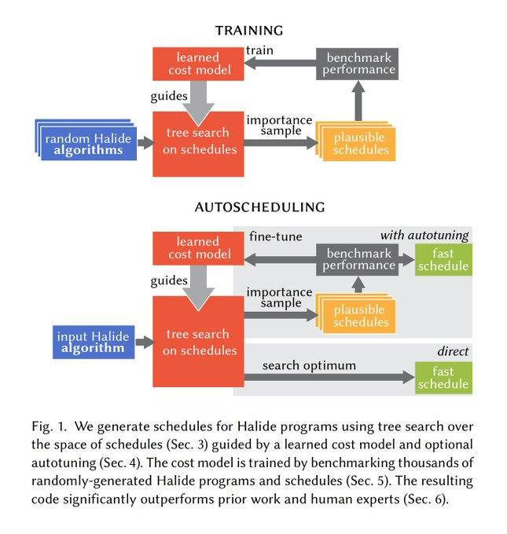

# Hurry! oneAPI

It has been a while since Intel announce its ambitious project: oneAPI, a set of libraries and toolkit that is expected to fill the gap between machine learning ops and optimized kernel execution on a wide diversity of devices.

## DL Framework

Let's take a brief review of what a dl framework does:

Like the graph indicates, algorithm researchers use dl APIs provided by frameworks to portrait what the graph looks like, dynamically or statically. Here we saved the words for what a *graph* is in deep learning models.

In the perspective of machines, the graph details the data, which we usually identify as *tensors* in deep learning, and the operations processing data. To allocate data and execute the ops on specific devices, such like CPU, (AMD/NVIDIA/Intel) GPUs and other accelerators, a compiler is required to translate the ops into what . Given the facts that most deep learning engineers prefer the Python API from a framework, and dl frameworks prefer C++ as an efficient programming language to describe what the operation actually does, the ops are usually defined in a combined style of Python and C++, where the python works as a glue.

Of course, for better performance, the compiler mentioned above is also expected to automatically optimize the actual execution of kernels for specific devices. For example, the dl framework or its compiler need to figure out the best algorithm for a convolution operation, the hyper-parameters when executing the algorithm, such as the tile size, number of threads, size of L2, etc.

More recently, there is, or seems about to have, an explosion of AI chips, especially for model inference. For inference on cloud, GPUs from NVIDIA are definitely dominating while big-corp like AWS, Intel, Alibaba and Tecent are all pursuing to develop their own AI chips. In our pocket (cell phones), or above our heads (CCTVs), or in our living room (TV boxes and game consoles), the demands for on-device inference also accelerates companies like Apple, Qualcomm and Cambricon's effort to provide more performance with lower energy cost in their chips. Why am I talking this? Because when deploying a fine-tuned model to those devices, apart from the benefits from the chips, we also would like to have an optimized kernel execution on these chips, which is more difficult compared with Intel CPUs and NVIDIA GPUs. That is because these on-device chips are newer, with fewer user cases and lacking more engineers to come up with an equally comprehensive toolkit chain for developing, profiling and tuning.

NVIDIA released A100 chip days before, which a 50% bump in price, though it claims a 20X improvement in DL training. But using AMD GPU still remains an promising alternatives to lower infrastructure cost. 

## Halide-lang

It seems a mess in the deep learning optimization topic on various devices. Countless types of devices with drastic distinguished properties. Not to mention the deep learning models are also evolving.

This problem is not unique to deep learning. Image processing shares this problem. When using different filters in any camera apps, image processing is taking what the lens absorbs and applying complicated mathematical operations, often element-wisely. This pattern looks rather similar to what the deep learning does.

*[Halide](https://halide-lang.org/#gettingstarted) is a programming language designed to make it easier to write high-performance image and array processing code on modern machines.*

The most enlightening idea that Halide offers is that we can *[separate the algorithm, what you want to compute, and the schedule, how you want to compute](https://halide-lang.org/papers/halide_autoscheduler_2019.pdf)*. In its implementation, the Halide language defines a set of IR, intermediate representation, to describe the filters for images and use a multi-target compiler to translate the set of IRs to the optimized machine code on specific devices via low-level APIs including CUDA, OpenCL, Apple Metal, DirectX and so on.

This idea inspires [TVM](https://tvm.apache.org/) to come up with its own IR standard for machine learning. The origin purpose of TVM, if my recall is correct, is to use its ML IRs to represent dl models described in different frameworks and use its compiler to optimize executions on many devices. While the TVM seems no very successful (forgive me if I'm wrong) in the community and industry, I can't agree with its idea and goal more. (And the I think one of the reason is this topic is unfairly favors the device manufactories. TVM does not produce any AI chips. Its opt algorithm may easily be outperformed by tiny effort from Intel/NVIDIA.)

## TFRT & openAPI

## ROCm from AMD

## A better future