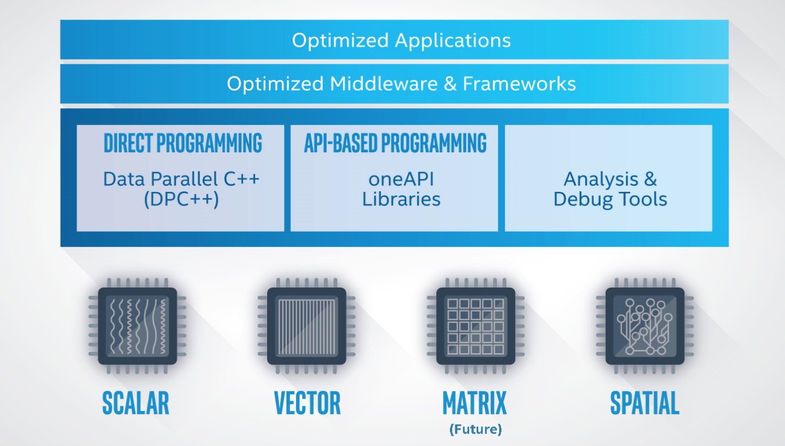

# Hurry! oneAPI

It has been a while since Intel announced its ambitious project: oneAPI, a set of libraries and toolkit that is expected to fill the gap between machine learning ops and optimized kernel execution on a wide diversity of devices.

## DL Frameworks and Devices

Let's take a brief review of what a deep learning (dl) framework does:

Like the graph indicates, algorithm researchers use dl APIs provided by dl frameworks to portrait the graph, dynamically or statically. Here we save the words for what a *graph* is in dl models.

In the perspective of machines, the dl model details the data, which we usually identify as *tensors* in deep learning, and the operations processing data. To allocate data and execute the ops on specific devices, such like CPU, GPUs and other accelerators, a compiler is required to translate ops into specific machine code. Given the facts that most dl engineers prefer Python API from a framework, and dl frameworks prefer C++ as an efficient programming language to describe what the operation actually does, the ops are usually defined in a combined style of Python and C++, where the python works as glue.

Of course, for better performance, the compiler mentioned above is also expected to automatically optimize the actual execution of kernels for specific devices. For example, the dl framework or its compiler needs to figure out the best algorithm for a convolution operation, the hyper-parameters when executing the algorithm, such as the tile size, number of threads, shared array size in L2, etc.

More recently, there is, or seems about to have, an explosion of AI chips, especially on model inference. For inference on cloud, GPUs from NVIDIA are definitely dominating, while big-corps like AWS, Intel, Alibaba and Tecent are all pursuing their own AI chips. On the other side, in our pocket (cell phones), or above our heads (CCTVs), or in our living room (TV boxes and game consoles), the demands for on-device inference also accelerate companies like Apple, Qualcomm and Cambricon to provide chips with more performance at a lower energy cost. When deploying a fine-tuned model to those devices, apart from the benefits from the chips, we also would like to have optimized kernel executions on these chips, which is more difficult compared with Intel CPUs and NVIDIA GPUs. That is because these on-device chips are newer, with fewer user cases and lacking more engineers to come up with an equally comprehensive toolkit stack for developing, profiling and tuning.

On the price side, NVIDIA released A100 chip days before, which a 50% bump in price, though it claims a 20X improvement in DL training. But using AMD GPU still remains an promising alternatives to lower infrastructure cost. 

## Halide-lang

It seems a mess in the dl optimization topic on various devices. Countless types of devices with drastic distinguished properties. Not to mention the dl models are also evolving.

This problem is not unique to deep learning. Image processing shares this problem. When using different filters in any camera apps, image processing is taking what the lens absorb and applying complicated mathematical operations, often element-wisely. This pattern looks rather similar to what deep learning does.

*[Halide](https://halide-lang.org/#gettingstarted) is a programming language designed to make it easier to write high-performance image and array processing code on modern machines.*

The most enlightening idea that Halide offers is that we can *[separate the algorithm, what you want to compute, and the schedule, how you want to compute](https://halide-lang.org/papers/halide_autoscheduler_2019.pdf)*. In its implementation, the Halide language defines a set of IR, intermediate representation, to describe the filters for images and use a multi-target compiler to translate the set of IRs to the optimized machine code on specific devices via low-level APIs including CUDA, OpenCL, Apple Metal, DirectX and so on.

This idea inspires [TVM](https://tvm.apache.org/) to come up with its own IR for machine learning. The origin purpose of TVM, if my recall is correct, is to use its ML IRs to represent dl models described in different frameworks and use its compiler to optimize executions on diverse devices. While the TVM seems not very successful (forgive me if I'm wrong) in the community and industry, I can't agree more with its idea and goal. (I think one of the reason is execution optimization is unfairly favors device manufactories. TVM does not produce any AI chips. Its scheduling algorithm would easily be out-performed by tiny effort from Intel/NVIDIA.)

## TFRT & openAPI

It seems this idea is wide-spread among both TensorFlow community and Intel.

### TensorFlow Runtime

After the setback of TensorFlow 2.0, I'm not sure if [TensorFlow Runtime (TFRT)](https://blog.tensorflow.org/2020/04/tfrt-new-tensorflow-runtime.html) counts as it latest effort to maintain its dominant position in dl stack. (While we see the decline and climb of TensorFlow and PyTorch in research usage, it looks the comprehensiveness of TensorFlow, consisting of TFX, TFLite and TFServing keeps the inertia of TensorFlow in industry.)

The blog and presentation of TFRT impressed me with its idea to acts as the hub for ops and targeting CPU, GPU, TPU and mobile devices.

Even without reading the source code of TensorFlow, from the experience of adding new ops in TF, this framework links the op and its device-specific implementation (in C++). When deploying on mobile devices, TFLite is additionally required. However, it seems TFRT can take the model directly and use it mobile-targeting part to accelerate the inference.

From the source code of [TFRT](https://github.com/tensorflow/runtime), this new layer in TensorFlow is born out of [MLIR](https://www.tensorflow.org/mlir), which *defines a common intermediate representation (IR) that unifies the infrastructure required to execute high performance machine learning models in TensorFlow and similar ML frameworks*. I bet, when releasing MLIR, TensorFlow wishes other *similar ML frameworks*, like mxnet or PyTorch, can come to the arena of TensorFlow, using MLIR as the universal layer. This idea is *partially* adopted by Intel.

### oneAPI

I do hope that [oneAPI](https://software.intel.com/content/www/us/en/develop/download/oneapi-product-brief.html) is not just re-branded mkl-dnn, mkl, mlsl and many other tools previously developed by Intel.

If we mask the graph above with deep learning:

- the *optimized application* means *optimized* refers training programs and inference applications
- *optimized middleware&framework* refers dl frameworks like Caffe, TensorFlow, PyTorch optimized by Intel or here we say oneAPI group
- *oneAPI Libraries* include oneMKL which accelerate basic math operations, oneDNN which has its optimized implementation for different targets, oneCLL which you can think as a library similar to Gloo and NCCL
- The devices in the graph refers CPUs, GPUs, and AI chips (all of which I hope also from vendors besides Intel)

So far, there are two disappointments in oneAPI:

1. the whole set of toolkit are still Intel-exclusive. While [ComputeCpp](https://www.codeplay.com/products/computesuite/computecpp) from [Codeplay](codeplay.com) does bring DPC++ to oneAPI via NVIDIA's OpenCL API, such support has not infiltrated into ondDNN, the critical library dl frameworks are expected to use
2. the concept of IR seems not adopted after reviewing the source code of [oneDNN](https://github.com/oneapi-src/oneDNN). Although without (ML) IR, oneAPI can still optimize implementation for ml ops, some effort looks cumbersome since one operation, even deployed on different devices, still share some characteristic on scheduling.

## ROCm from AMD

Lacking the support for AMD CPU and GPU seems most disappointing part in oneAPI. It may seem naive, but I still hope the community work can break the fence of interest and help each others.

At this moment, AMD offers its own stack for deep learning, which is called [ROCm](https://www.amd.com/en/graphics/servers-solutions-rocm).

likewise, the full stack is now able to provide end-to-end acceleration for dl training and inference, even on Kubernetes with its own [device plugin](https://github.com/RadeonOpenCompute/k8s-device-plugin).

> Interesting story, in the early stage of AMD-modified DL frameworks, AMD re-implemented most all CUDA runtime APIs with AMD GPU backend. Even when executing `torch.cuda.is_available()` on ROCm platform, it will return **`True`**.

So far, I believe you must have seen enough duplicated works from AMD/Intel/NVIDIA on deep learning. Many of those share the same functionalities, designs and even third-party libraries. In the war for dl revenue, such situation could still last for a considerable period.

## A better future

The traditional wisdom tells us that the unity follow separations. I do wish the dl frameworks finally can fit in a universal design:

With a universal layer of ML IR, converting dl models between different frameworks becomes effortless.

With a universal layer of processing, porting training program to AMD GPU with lower cost shall take zero change in scripts and no need to worry about the performance and compatibility when using models for inference.

On such course, oneAPI still looks promising to me. But hurry! oneAPI! An open mind to the community benefits every party.